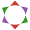

<div align="center">

<picture>
  <source media="(prefers-color-scheme: light)" srcset="docs/src/assets/logo.svg">
  
</picture>

**Compute sun-position angles and irradiance components in Julia**

</div>

Install `Irradia.jl` from the Julia REPL
```
] add https://github.com/nicomignoni/Irradia.jl.git
```

Check out the [docs]() for a quickstart.
